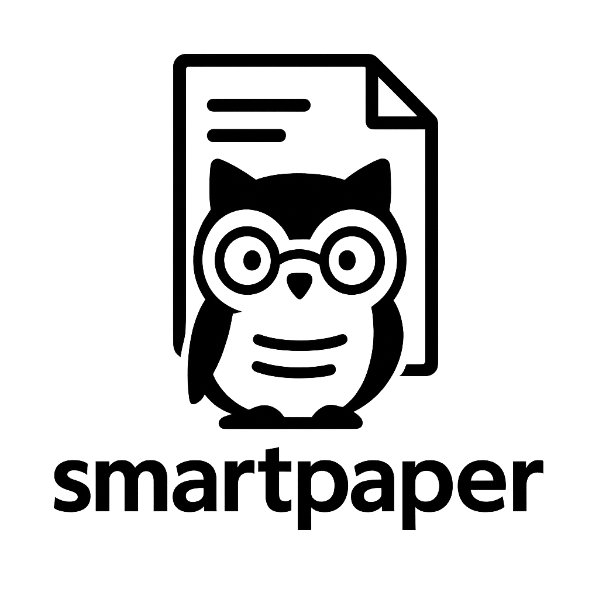

# SmartPaper

<p align="center">
  
</p>

<p align="center">
  <strong>智能学术论文处理与分析系统</strong>
</p>

<p align="center">
  <!-- 项目徽章 -->
  <a href="https://github.com/sanbuphy/SmartPaper/stargazers"></a>
  <a href="https://github.com/sanbuphy/SmartPaper/network/members"></a>
  <a href="https://github.com/sanbuphy/SmartPaper/issues"></a>
  <a href="https://github.com/sanbuphy/SmartPaper/blob/main/LICENSE"></a>
  <a href="https://github.com/sanbuphy/SmartPaper/pulls"></a>
  <a href="https://github.com/sanbuphy/SmartPaper/commits"></a>
</p>

<p align="center">
  <b>📑 快速分析论文 | 🧠 多模型支持 | 📊 结构化输出 | 🔌 易于扩展</b>
</p>

<p align="center">
  <a href="#功能特点">功能特点</a> •
  <a href="#技术架构">技术架构</a> •
  <a href="#安装指南">安装指南</a> •
  <a href="#快速开始">快速开始</a> •
  <a href="#使用说明">使用说明</a> •
  <a href="#开发指南">开发指南</a> •
  <a href="#贡献者">贡献者</a> •
  <a href="#许可证">许可证</a>
</p>

> **注意**：项目当前处于高速迭代阶段，API 可能会发生变动。架构稳定后将尽量避免核心代码变更。

## 项目概述

**SmartPaper** 是一个专为研究人员、学者和学生设计的智能学术论文处理系统，能够自动化论文获取、解析、内容提取和分析等任务。系统利用先进的 AI 模型（如 GPT 系列、Qwen 系列等）和版面分析技术，提供高效、准确的论文理解和信息提取服务。无论您是研究人员、学生还是对最新研究感兴趣的专业人士，SmartPaper 都能帮助您更高效地理解和提炼复杂的学术内容。

## 功能特点

### 📱 多模型支持

- **国内外主流大模型**：
  - 文心一言大模型
  - OpenAI (GPT系列)
  - Deepseek
  - SiliconFlow
  - Kimi (Moonshot)
  - 豆包 (Doubao)
  - 智谱AI

### 📄 灵活输入

- **多种输入方式**：
  - 单个 PDF 文件分析
  - 论文 URL（支持 arXiv 格式自动转换和验证）

### 🧠 智能分析

- **多模态分析**：同时处理文本内容和图像信息
- **自动摘要生成**：生成论文内容的简洁摘要
- **关键观点提取**：提取论文的主要贡献和方法
- **图表理解**：识别并解释论文中的图表内容
- **多种分析模式**：
  - **单提示词模式**：使用精心设计的提示词模板高效分析
  - **Agent 模式**：智能对话式深度分析（开发中）

### 系统功能

- **多模态分析**：同时处理文本内容和图像信息
- **缓存机制**：智能缓存处理结果，避免重复处理
- **RESTful API**：提供易用的 API 接口
- **多种交互方式**：
  - 命令行工具（标准模式和流式输出模式）
  - 基于 Streamlit 的直观图形界面

## 技术架构

SmartPaper 采用模块化设计，主要包含以下模块：

- **PDF 解析模块**：负责从 PDF 中提取文本和图像
- **版面分析模块**：识别文档结构和元素布局
- **下载器模块**：处理论文的获取和缓存
- **多模型支持模块**：提供统一的模型接口
- **提示词管理模块**：管理不同场景的提示词模板
- **API 应用层**：提供 RESTful API 服务

## 安装指南

### 环境要求

- Python 3.8 或更高版本
- uv 包管理工具

### 使用 uv 安装

SmartPaper 推荐使用 [uv](https://github.com/astral-sh/uv) 进行依赖管理和虚拟环境管理：

1. 安装 uv（如果尚未安装）:

```bash
pip install uv
```

2. 创建特定Python版本的虚拟环境（推荐使用Python 3.10）:

```bash
uv venv --python=3.10
```

3. 激活虚拟环境:

```bash
# Windows
.venv\Scripts\activate

# Linux/macOS
source .venv/bin/activate
```

4. 安装项目依赖:

```bash
uv pip install -e .
```

5. 安装开发依赖（可选）:

```bash
uv pip install -e ".[dev]"
```

6. 验证安装:

```bash
python -c "import smartpaper; print('SmartPaper 安装成功!')"
```

### conda 与 uv 共存环境

如果您的系统中同时安装了 conda 和 uv，可以采用以下策略避免冲突：

1. **使用 conda 创建基础环境，uv 管理依赖**:

```bash
# 使用 conda 创建基础 Python 环境
conda create -n smartpaper python=3.10
conda activate smartpaper

# 在 conda 环境中安装并使用 uv 管理依赖
pip install uv
uv pip install -e .
```

2. **完全使用 uv（推荐）**:

```bash
# 暂时停用 conda 环境
conda deactivate

# 使用 uv 创建和管理环境
uv venv --python=3.10
# Windows
.venv\Scripts\activate
# Linux/macOS
# source .venv/bin/activate

uv pip install -e .
```

3. **完全使用 conda**:

```bash
conda create -n smartpaper python=3.10
conda activate smartpaper
conda install pip
pip install -e .
```

## 快速开始

### 配置说明

（注意：请先配置api_key）
SmartPaper 使用 YAML 文件进行配置，主要配置项包括：

- **LLM 配置**：配置不同的大语言模型服务
- **VLM 配置**：配置视觉语言模型服务
- **文档转换器**：选择 PDF 处理方式

配置文件位于 `SmartPaper/config_files/config.yaml`，可以从 `SmartPaper/config_files/config.yaml.example` 复制并修改：

```bash
cp config.yaml.example config.yaml
# 编辑 config.yaml 添加你的 API 密钥和自定义设置
```

### 启动 API 服务

```bash
cd src
uvicorn app.main:app --reload --host 0.0.0.0 --port 8000
```

访问 API 文档：<http://localhost:8000/docs>

### 命令行分析论文

```bash
# 使用默认提示词模板分析指定论文
python cli_get_prompt_mode_paper.py https://arxiv.org/pdf/2312.12456.pdf

# 指定提示词模板
python cli_get_prompt_mode_paper.py https://arxiv.org/pdf/2312.12456.pdf -p coolpapaers

# 流式输出模式
python cli_get_prompt_mode_paper_stream.py https://arxiv.org/pdf/2312.12456.pdf
```

### 启动图形界面

```bash
streamlit run streamlit_app.py
```

访问 Streamlit 界面：<http://localhost:8501>

Streamlit 界面提供了以下功能：

- 通过 arXiv ID 分析论文
- 上传和处理本地 PDF 文件
- 选择不同的解释模式（如 coolpapaers、yuanbao 等）
- 选择不同的 LLM 提供商和模型
- 启用/禁用图文模式（提取论文图片）
- 实时流式显示分析结果

## API 文档

SmartPaper 提供了全面的 RESTful API,地址：[api文档](./app/docs/api.md)，支持以下主要功能：

### 论文管理 API

- **上传论文**：上传 PDF 文件到服务器

  ```http
  POST /upload_paper
  ```

- **列出已上传论文**：获取所有已上传的论文列表

  ```http
  GET /list_uploaded_papers
  ```

### 配置管理 API

- **获取/更新配置**：管理系统配置

  ```http
  GET /config
  POST /config
  ```

- **获取可用模型**：列出所有支持的模型

  ```http
  GET /models
  ```

### 提示词管理 API

- **获取/更新提示词模板**：管理分析提示词

  ```http
  GET /api/v1/prompts/list
  POST /api/v1/prompts/update
  ```

完整的 API 文档可在启动服务后通过 `/docs` 端点访问，或查看 `app/docs/api.md` 文件。

## 开发指南

### 代码规范

本项目使用 pre-commit 进行代码质量控制：

```bash
# 安装 pre-commit
pip install pre-commit
pre-commit install

# 首次检查所有文件
pre-commit run --all-files
```

每次提交代码时，pre-commit 将自动检查修改的文件，确保符合项目代码规范。

## 开发路线图

- [ ] Agent 模式增强
- [ ] CSV 格式结构化输出
- [ ] 结构化文件夹输出
- [ ] 支持更多论文来源和格式
- [ ] 批量处理优化
- [ ] 进度可视化改进
- [ ] 可视化提示词模板编辑器
- [ ] 跨平台桌面应用支持
- [ ] 国际化支持

## 示例展示

### 分析报告示例

```markdown
# 论文分析报告

## 元数据
- 标题: Transformer-Based Visual Segmentation: A Survey
- 作者: Zhang et al.
- URL: https://arxiv.org/pdf/2304.09854.pdf
- 分析时间: 2024-05-15T14:30:00

## 研究背景
本文是一篇关于基于Transformer的视觉分割技术的综述论文。视觉分割是计算机视觉中的基本任务，包括语义分割、实例分割和全景分割等。随着Transformer在自然语言处理领域取得突破性进展，研究人员开始将其应用于视觉分割任务，并取得了显著成果。

## 核心方法
论文系统地回顾了基于Transformer的视觉分割方法，将其分为四类：
1. **纯Transformer架构**：完全基于自注意力机制的方法
2. **CNN-Transformer混合架构**：结合CNN和Transformer优势的方法
3. **轻量级Transformer**：针对资源受限场景的高效实现
4. **特定任务的创新**：针对特定分割任务的专门设计

## 实验结果
论文对比了各类方法在主流基准测试上的性能，包括Cityscapes、ADE20K等数据集。结果表明：
- 纯Transformer模型在高分辨率图像上表现优异
- 混合架构在平衡精度和效率方面表现良好
- 轻量级设计在移动设备上取得了实用性能

## 未来方向
1. 更高效的注意力机制设计
2. 自监督学习与Transformer分割的结合
3. 针对特定领域的专用模型优化
4. 模型可解释性研究
```

## 参与贡献

我们非常欢迎和感谢各种形式的贡献！

### 贡献流程

1. Fork 本仓库
2. 创建您的特性分支 (`git checkout -b feature/amazing-feature`)
3. 提交您的更改 (`git commit -m 'Add some amazing feature'`)
4. 推送到分支 (`git push origin feature/amazing-feature`)
5. 打开一个 Pull Request

## 贡献者

感谢以下贡献者为项目做出的宝贵贡献：

<div align="center">
  <a href="https://github.com/sanbuphy/SmartPaper">
    
  </a>
</div>

- [散步](https://github.com/sanbuphy) (Datawhale成员)
- [筱可](https://github.com/li-xiu-qi) (datawhale应用发烧友)
- [jingsongliujing](https://github.com/jingsongliujing)

## 许可证

本项目采用 [Apache 许可证 2.0](LICENSE) 进行许可。
